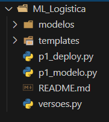
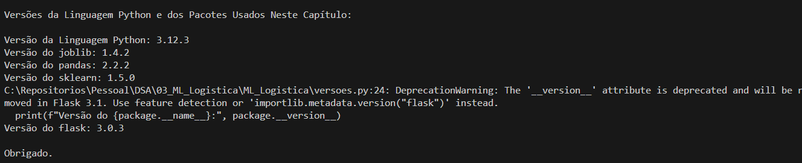
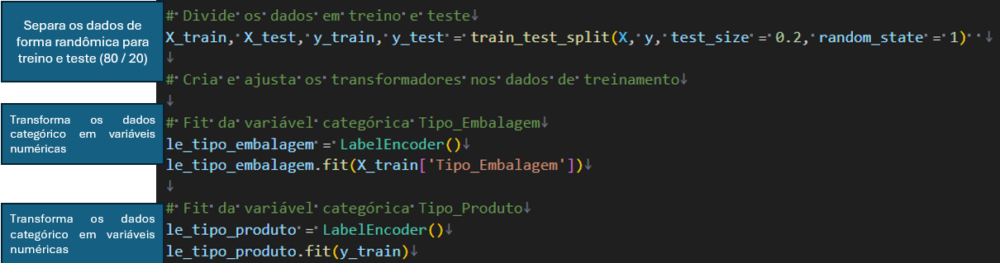
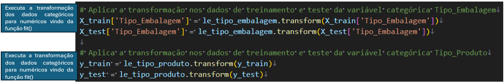
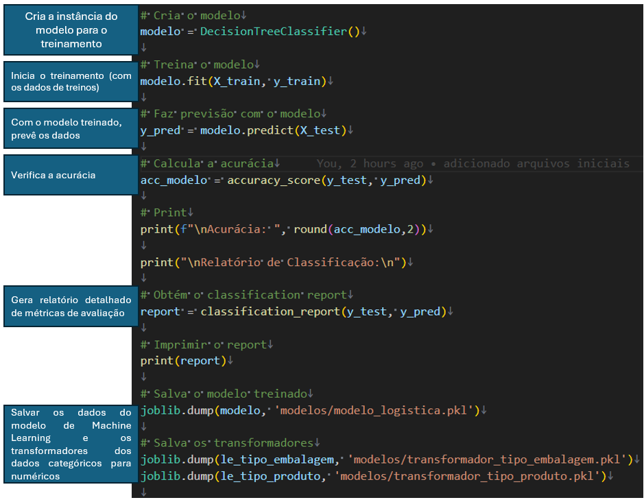
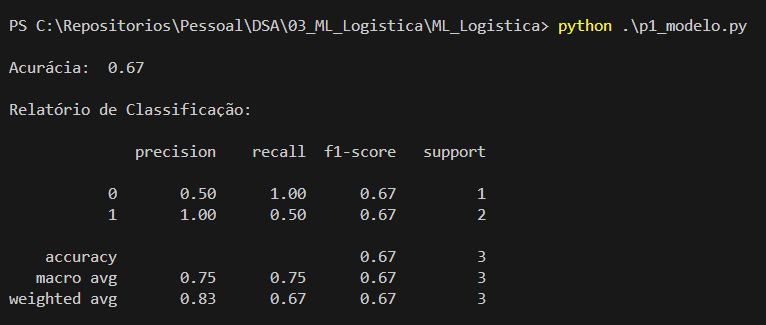

# ML_Logistica
Desenvolvimento de ML para a aréa da Logistica, este projeto visa prever o tipo de produto baseado no peso e o tipo de embalegem

  
Introdução

## Detalhes da pasta

* A pasta `modelo` contêm os dados dos modelos treinados
* A pasta `templates` contêm o template da pagina *HTML*
* O arquivo `p1_deploy`contêm o desenvolvimento de software
* O arquivo `p1_modelo`contêm o desenvolvimento do *Machine Learning*
* O arquivo `versoes`contêm o código para verificar as versões dos pacotes
  

  
versões.py

## executando o arquivo versoes.py

Executa o arquivo para avaliar os pacotes e versões instalados para este projeto

  
p1_modelo.py

## executando o arquivo p1_modelo.py
Executa as primeiras linhas para:
- importar os pacotes;
- trazer os dados de entradas e saidas;
- separar os dados
  

no proximo passo é feito:
- separação dos dados em treino e teste;
- aprendizado dos parâmetros categóricos para numéricos
  

no proximo passo é feito:
- transformação dos dados categóricos para numéricos definidos pelo fit (aprendizado dos parâmetros)
  

no proximo passo é feito:
- treina o modelo de Machine Learning
- prevê os dados (inferência)
- verifica a acurácia do modelo
- gera relatório de desempenho
- salva os pesos do modelo e transformadores
  

Resultado do treinamento:
- acurácia de 67%
- Precisão (proporção de verdadeiros positivos previstos positivos) está para 50% a classe 0 (Caixa de Papelão) e 100 % a classe 1 (Plástico Bolha)
- Recall (proporção de verdadeiros positivos realmente positivos) está para 100% a classe 0 (Caixa de Papelão) e 50 % a classe 1 (Plástico Bolha)
- F1-score que é a média harmônica da precisão e do recall proporciona uma média equilibrada em ambas de 67%
- Macro Average: A média aritmética das métricas para todas as classes (não ponderada)
- Weighted Average: A média ponderada das métricas para todas as classes, levando em conta o suporte de cada classe.
  

