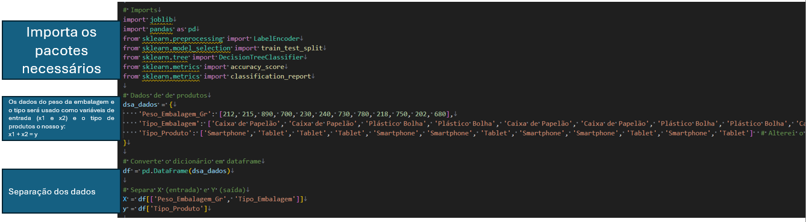
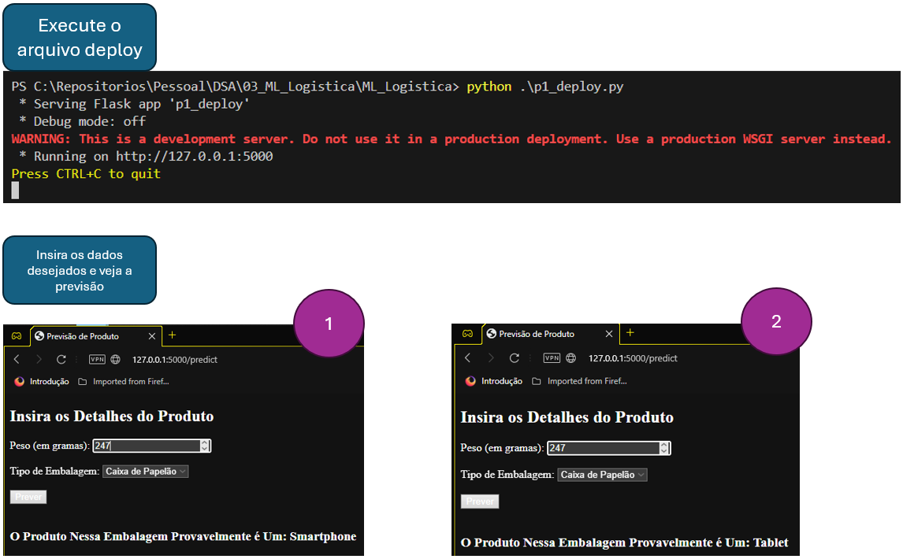

# ML_Logistica

Desenvolvimento de Machine Learning para a área de Logística. Este projeto visa prever o tipo de produto baseado no peso e no tipo de embalagem.

  
Introdução

  
  ## Estrutura do Projeto

  
  
  - A pasta `modelo` contém os dados dos modelos treinados.
  - A pasta `templates` contém o template da página *HTML*.
  - O arquivo `p1_deploy.py` contém o desenvolvimento do software para deployment.
  - O arquivo `p1_modelo.py` contém o desenvolvimento do modelo de *Machine Learning*.
  - O arquivo `versoes.py` contém o código para verificar as versões dos pacotes utilizados.
  

  
versoes.py

  
  ## Executando o arquivo `versoes.py`

  
  
  Este script verifica os pacotes e versões instalados para este projeto.
  

  
p1_modelo.py

  
  ## Executando o arquivo `p1_modelo.py`

  Este script realiza as seguintes etapas:

  1. **Importação dos Pacotes e Preparação dos Dados**
     - Importa os pacotes necessários.
     - Carrega os dados de entrada e saída.
     - Separa os dados.

     
  
  2. **Divisão dos Dados**
     - Divide os dados em conjuntos de treino e teste.
     - Aprende os parâmetros categóricos para convertê-los em numéricos.
     
     
  
  3. **Transformação dos Dados**
     - Transforma os dados categóricos em numéricos com base no ajuste (`fit`).

     
  
  4. **Treinamento e Avaliação do Modelo**
     - Treina o modelo de Machine Learning.
     - Realiza previsões (inferência).
     - Verifica a acurácia do modelo.
     - Gera um relatório de desempenho.
     - Salva o modelo treinado e os transformadores.

     

  ### Resultado do Treinamento:
  - **Acurácia**: 67%
  - **Precisão**:
    - Classe 0 (Caixa de Papelão): 50%
    - Classe 1 (Plástico Bolha): 100%
  - **Recall**:
    - Classe 0 (Caixa de Papelão): 100%
    - Classe 1 (Plástico Bolha): 50%
  - **F1-Score**: Média harmônica da precisão e recall, equilibrada em 67%.
  - **Macro Average**: Média aritmética das métricas para todas as classes (não ponderada).
  - **Weighted Average**: Média ponderada das métricas para todas as classes, considerando o suporte de cada classe.
  
  
  

  
p1_deploy.py

  
  ## Executando o arquivo `p1_deploy.py`

  Este script realiza as seguintes etapas:

  1. **Importação e Inicialização**
     - Importa os pacotes necessários.
     - Instancia o Flask.
     - Carrega o modelo e os transformadores salvos.

     
  
  2. **Renderização da Página e Previsão**
     - Renderiza a página inicial.
     - Extrai a previsão do produto a partir dos dados de entrada.

     
  
  3. **Execução e Uso**
     - Executa o código Python.
     - Utiliza via navegador, inserindo os dados e obtendo o resultado.

     
  

Esta estrutura fornece uma visão detalhada do projeto e facilita a compreensão e a execução dos scripts para desenvolvimento, avaliação e deployment do modelo de Machine Learning.